## Arquitectura de Software 

### ACTIVIDAD 3

#### INTEGRANTES 

- DOMINGUEZ CARDENAS OSCAR ADRIAN

# Arquitectura de Microservicios – Sistema Editorial

##  Descripción
Proyecto académico que implementa una arquitectura basada en microservicios para la gestión de autores y publicaciones, utilizando Node.js, TypeScript, Docker y BPMN.

---

##  Arquitectura del Sistema
El sistema está compuesto por:
- Microservicio Authors
- Microservicio Publications
- Frontend (React)
- Bases de datos MySQL
- Docker Compose para orquestación

### Diagrama de arquitectura:
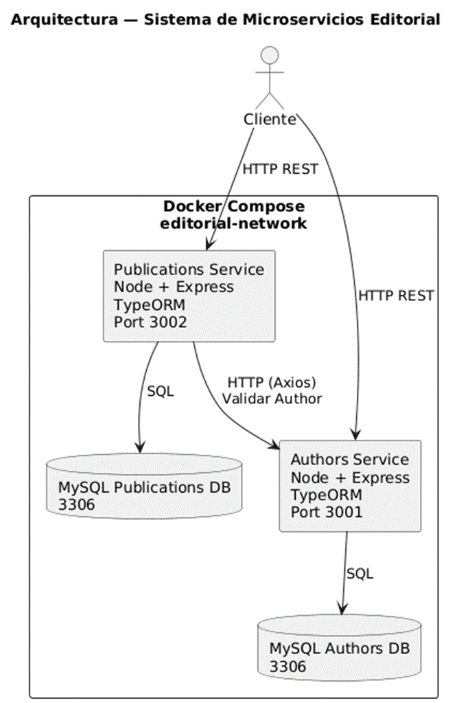

---

##  Ejecución del Proyecto

### Levantar el sistema

docker compose up --build

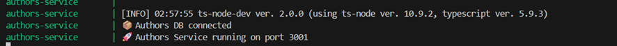

### Crear autor
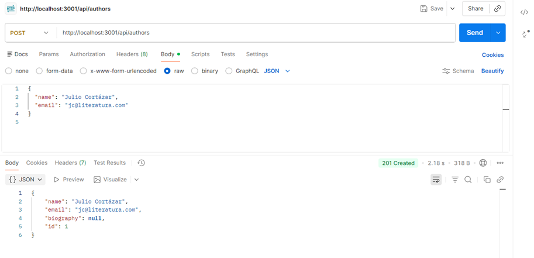

### Crear publicación
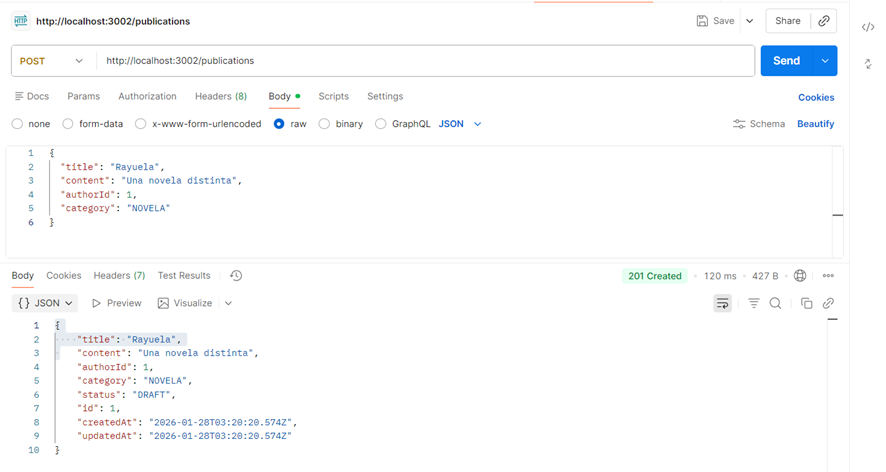

### Listar autores
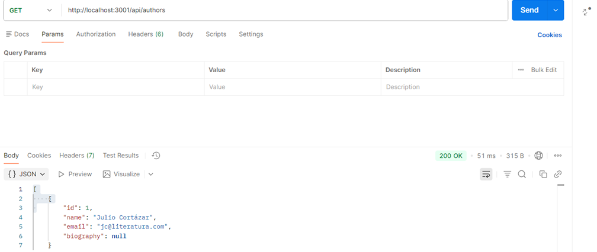

### Listar publicaciones
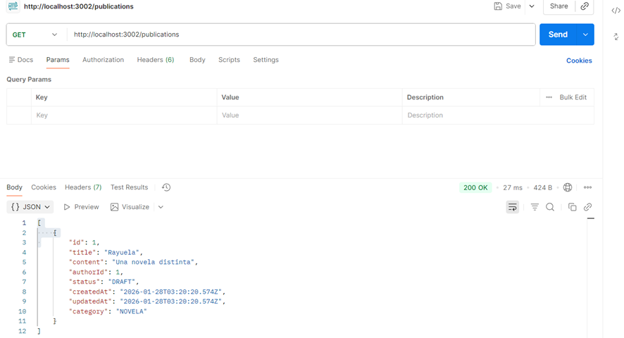

### Buscar autor con authorId correcto
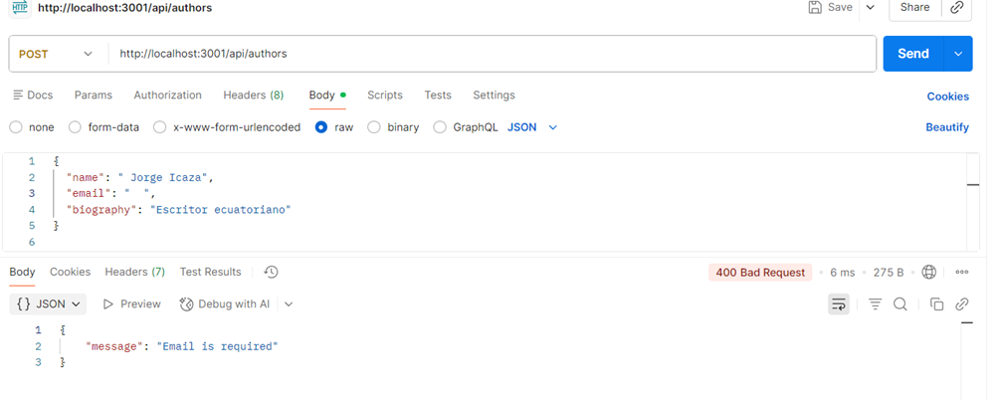

### Prueba: ingresar datos incompletos 1

### Prueba: ingresar datos incompletos 2
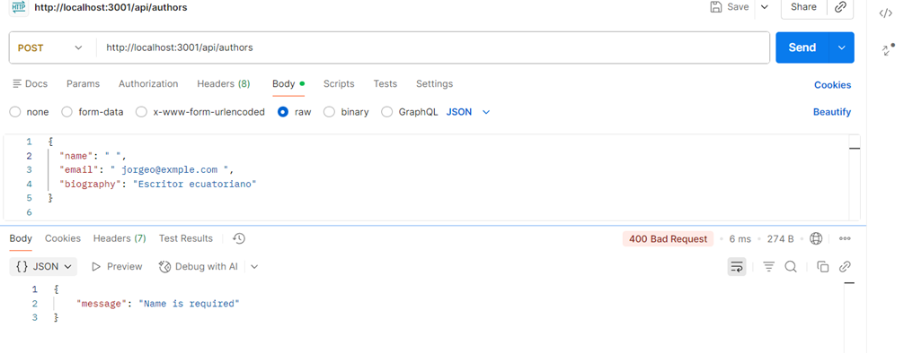

### Prueba: ingresar datos incompletos 3
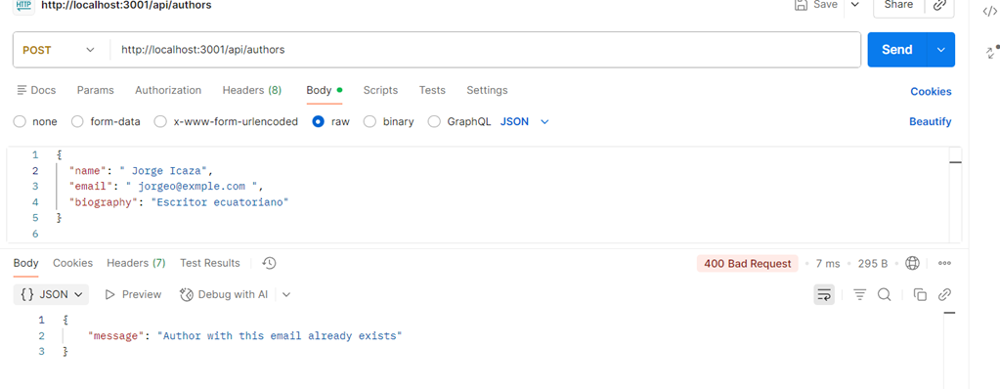

### Prueba: Obtener autor por ID inexistente
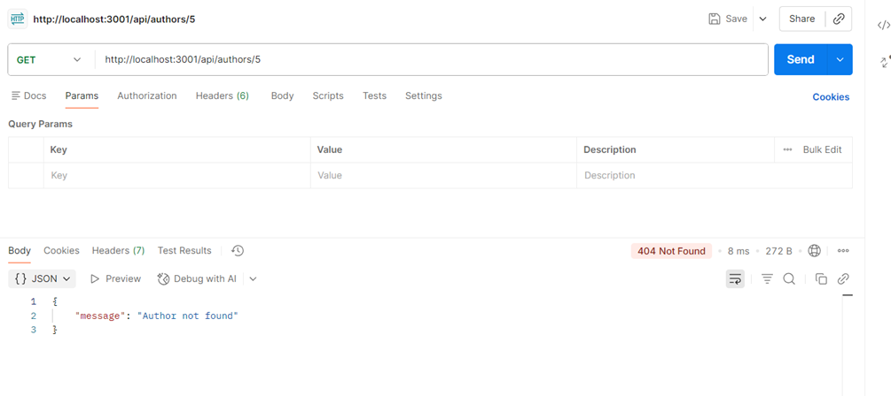

### Crear publicación con la id de un autor inexistente.
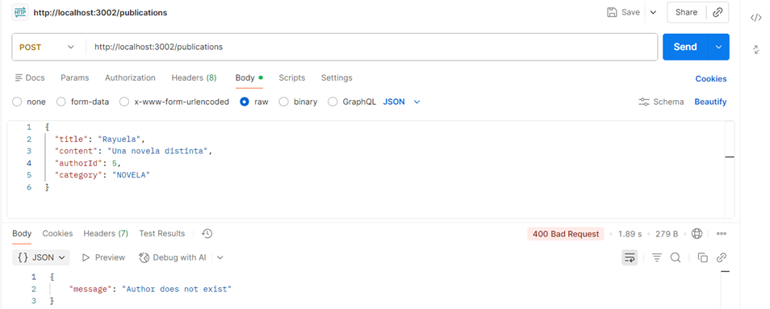

### Buscar Endpoint inexistente en publicaciones 
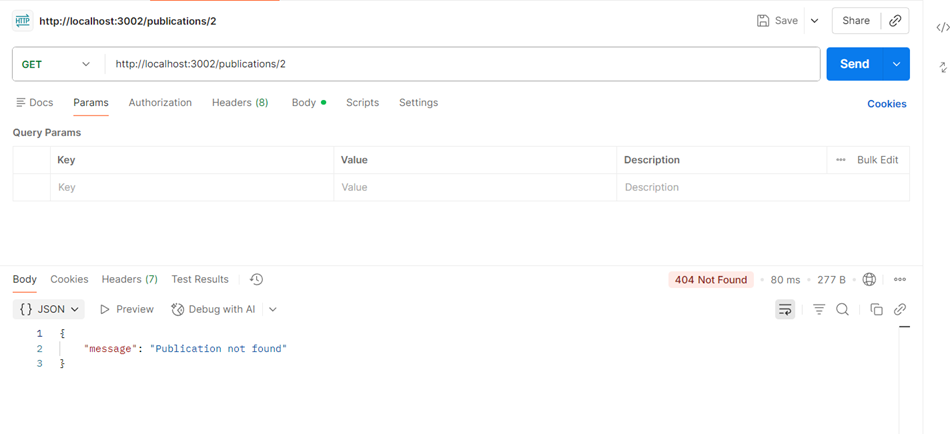

##  Ejecución del Proyecto en el Frontend

### Evidenciamos en el navegador nuestro “crear autor”:

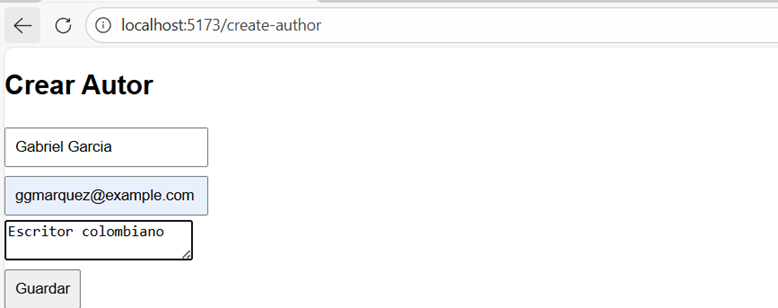

### Creado correctamente

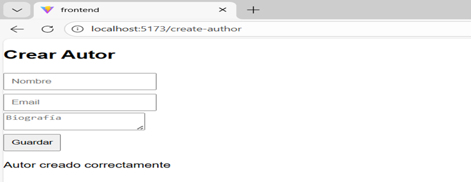

### listado

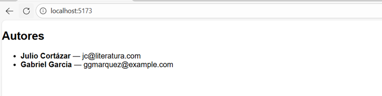

### Crear Publicaciones desde el Frontend 

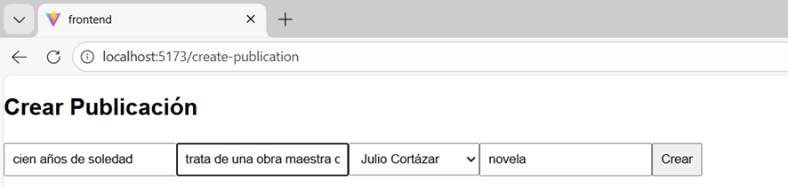

### Creado correctamente

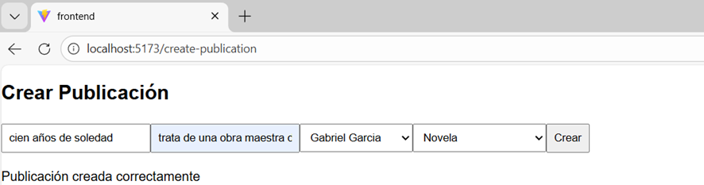

### no se crear Publicaciones por campos imcompletos

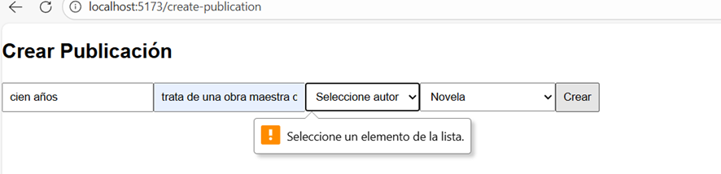

### Listar publicaciones en el frontend
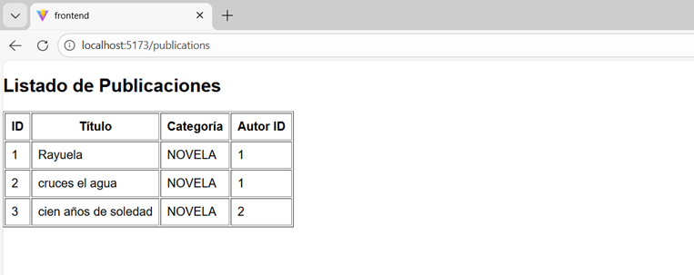

### Listar autores  en el frontend
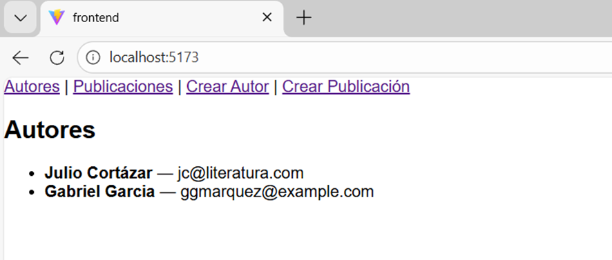

## Modelo BPMN del Proceso Editorial

### Si aprueba: preparar publicación → publicar → fin (publicado) 
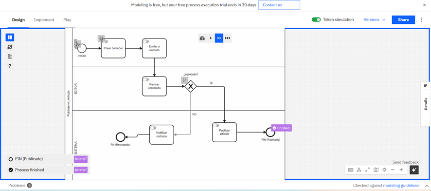

### Si rechaza: notificar rechazo → fin (rechazado)
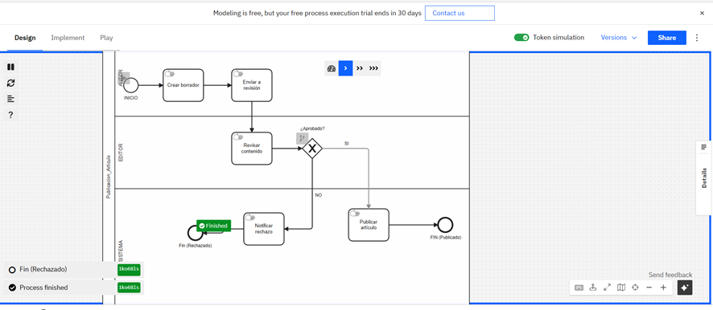
